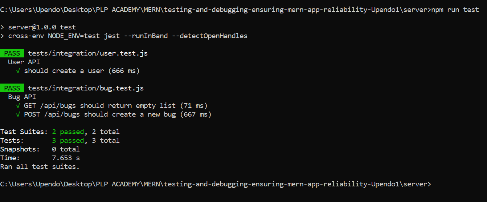
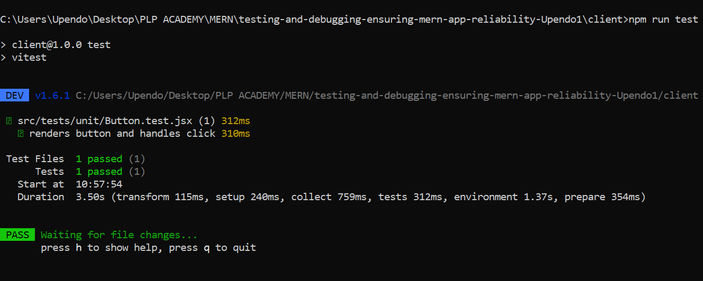

# Testing and Debugging MERN Applications

## Project Structure

```
mern-testing/
├── client/                 # React front-end
│   ├── src/                # React source code
│   │   ├── components/     # React components
│   │   ├── tests/          # Client-side tests
│   │   │   ├── unit/       # Unit tests
│   │   │   └── integration/ # Integration tests
│   │   └── App.jsx         # Main application component
│   └── cypress/            # End-to-end tests
├── server/                 # Express.js back-end
│   ├── src/                # Server source code
│   │   ├── controllers/    # Route controllers
│   │   ├── models/         # Mongoose models
│   │   ├── routes/         # API routes
│   │   └── middleware/     # Custom middleware
│   └── tests/              # Server-side tests
│       ├── unit/           # Unit tests
│       └── integration/    # Integration tests
├── jest.config.js          # Jest configuration
└── package.json            # Project dependencies
```


## Installation and Running the Project


1. Clone the repository:
   ```
   git clone <your-repo-url>
   cd mern-bug-tracker

2. Install backend dependencies:
  ```
   cd server
   npm install


3. Install frontend dependencies:
  ```
  cd ../client
  npm install


4. Start the backend server (default on port 5000):
```
npm run dev


5. Start the frontend development server:
```
npm run dev


### Running Tests


## Backend


- Navigate to the server directory and run:
```
npm run test


- Uses Jest and Supertest.


- Includes integration tests for API endpoints.


- Uses mongodb-memory-server to mock the database.


## Frontend


- Navigate to the client directory and run:

```
npm run test


- Uses Vitest with React Testing Library.


- Unit tests for React components (e.g., Button).


- Integration tests for UI interactions.


### Debugging Techniques


- Backend: Used console logs, Jest test outputs, and Node.js inspector for debugging.


- Frontend: Employed React Developer Tools, console logging, and Vitest test logs.


- Error Handling: Implemented Express error middleware and React Error Boundary to catch and handle errors gracefully.


### Testing and Debugging Approach


- Applied unit tests to individual functions and components.


- Developed integration tests to verify end-to-end API and UI workflows.


- Mocked external dependencies like the database during testing to isolate test environments.


- Introduced intentional bugs and used debugging tools to identify and resolve issues.


- Used error boundaries to prevent UI crashes on frontend.


### Additional Notes


- The frontend error boundary wraps the entire UI to catch runtime errors.


- Backend uses Express middleware for centralized error handling.


- Tests cover main CRUD operations and UI interactions.


### Screenshots


[](./screenshots/backendtest.PNG)  


[](./screenshots/frontendtest.PNG)
